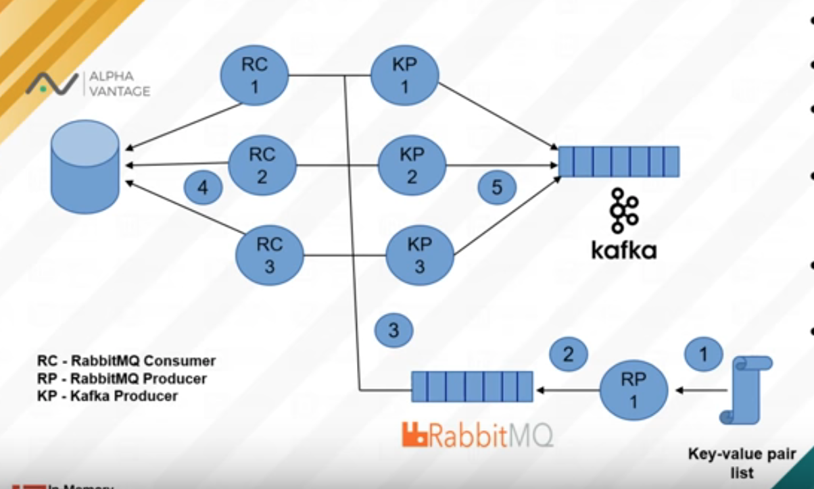

# Project

Get data from brokers in real time. This architecture covers a good load balancing and fault tolerance. In this version implements binance broker. (still under construction)

## Architecture

# Libraries:

- https://github.com/Binance-docs/Binance_Futures_python

## TO-DO:

- INIT DATABASES POSTGRES, INSERT PAIRS in Database table.
- script to wait service rabbit to be ready
